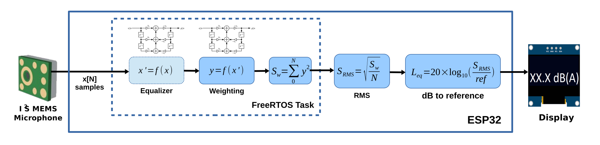

# device-firmware
Requires arduino studio

install esp32 plugin:

https://github.com/espressif/arduino-esp32

Board Mode: Node32s

Board: https://www.amazon.com/MELIFE-Development-Dual-Mode-Microcontroller-Integrated/dp/B07Q576VWZ/

Microphone: https://www.ebay.com/itm/Omnidirectional-Microphone-Module-I2S-Interface-INMP441-MEMS-volume-for-CWUS/143575760903

## Sound Level Meter with Arduino IDE, ESP32 and I2S MEMS microphone

Arduino/ESP32 Sound Level Meter (SLM) using inexpensive, factory calibrated, digital I2S MEMS microphone and digital IIR filters (vs. FFT) for equalization and A-weighting.

The basic idea is:

And the microphone response after equalization should look like:

Theoretically, i.e. with factory calibrated ICS-4343x, this should get you ±1dB(A) measurement within 20Hz-20KHz range.

The code in this repository is mostly intended as example how you can integrate resonable noise measurement (i.e. *L*Aeq, Equivalent Continuous Sound Level) in your projects. 

You can find a bit more information in my [hackday.io](https://hackaday.io/project/166867-esp32-i2s-slm) project.
